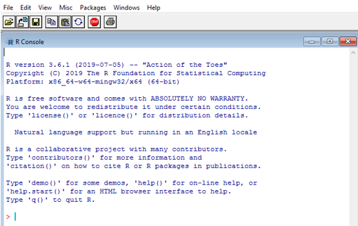

```{r setup, include=FALSE}
options(htmltools.dir.version = FALSE)

knitr::opts_chunk$set(echo = TRUE, 
                      tidy = 'styler', 
                      comment = NA,
                      message = FALSE,
                      warning = FALSE)
```


```{r xaringan-themer, include=FALSE, warning=FALSE}
library(xaringanthemer)
style_duo_accent(
  primary_color = "#1381B0",
  secondary_color = "#FF961C",
  inverse_header_color = "#FFFFFF"
)

# Loaded packages

install.load::install_load(c("knitr", "xaringanExtra", "xaringan", "tidyverse", "kableExtra", "countdown"))

xaringanExtra::use_xaringan_extra(include = c("tile_view", "editable", "share_again", "broadcast", "animate_css", "panelset", "tachyons", "fit_screen", "clipboard", "search", "scribble", "freezeframe"))


use_webcam(width = 150, height = 150)

use_animate_all("fade")

use_extra_styles()
```

class: title-page, center, middle

## RStudio, R packages, and R project

### A typical data science workflow in R

#### `r format(Sys.Date(), "%B %d, %Y")`

---

class: about-me-slide, inverse, middle, center

## About the trainer


### Ezekiel Adebayo Ogundepo

#### Data Scientist, Statistician

.fade[Data Science Nigeria<br>Lagos, Nigeria]


[`r icons::fontawesome("link")` https://bit.ly/gbganalyst](https://bit.ly/gbganalyst)
[`r icons::fontawesome("twitter")` @gbganalyst](https://twitter.com/gbganalyst)
[`r icons::icon_style(icons::fontawesome("github"), scale = 1)` @gbganalyst](https://github.com/gbganalyst)


---
class: middle

.w-100.lh-copy[

Goal:

> The goal of this training is to help you learn everything about R packages and how to import any data into R programming.

]

---
class: inverse
name: toc


# Table of content

.w-100.lh-copy[

- [R and RStudio](#beg1)

- [R packages and library](#beg2)

- [RStudio project](#beg3)
]

---

class: middle, center, inverse
name: beg1

# R and RStudio

---
## What is R programming

.w-100.lh-copy[
R is a statistical programming language for data cleaning, analysis, visualization, and modelling.
]

```{r, out.width= "85%", out.height="87%", echo=FALSE}

```

---

## What about RStudio?

.w-100.lh-copy[
RStudio is an integrated development environment (IDE) for R
programming. R Studio makes programming easier and friendly in R.
]

```{r, out.width= "85%", out.height="90%", echo=FALSE}
knitr::include_graphics("images/R_studio.PNG")
```
---

class: middle, center, inverse
name: beg2

# R packages and library

---

layout: true

## R packages and library

---

.w-100.lh-copy[
A package is a collection of R functions that extends basic R functionality (`base::functions`).
]

--

A package can contain a set of functions relating to a specific topic or tasks. 
--
For example, data wrangling packages include `tidyr`, `janitor`, etc.

--

.w-100.lh-copy[
The location where the packages are stored is called a **library**. If there is a particular package that you need, you can install the package from the Comprehensive R Archive Network (**CRAN**) by using:
]
--

```{r, eval=FALSE}
install.packages("pkg_name")
```
For example:

```{r, eval=FALSE}
install.packages("tidyverse")
```
--
.w-100.lh-copy[
Please note that the package name must be put on double quote (**" "**) or single quote (**' '**).
]

---

.w-100.lh-copy[
Other packages that are not yet on `CRAN` can also be installed from an external repository such as **GitHub** or **GitLab** by using `devtools` or `remotes` packages.
]

--

For example, package `fakir` is not on `CRAN` yet. 
--
 To install `fakir` from the `GitHub` repository,

--
use

--

```{r, eval=FALSE}
devtools::install_github("ThinkR-open/fakir")
```
--

or

--
```{r, eval=FALSE}
remotes::install_github("ThinkR-open/fakir")
```

--

.w-100.lh-copy[
You can also use `devtools` or `remotes` to install development version of a package. 
]

--

```{r, eval=FALSE}
remotes::install_github("datalorax/equatiomatic")
```

---
layout: false

## Import or load a package

.w-100.lh-copy[
To actually use any installed package, you will need to use the command:
]

--

```{r, eval=FALSE}
library("pkg_name")
```
--

.w-100.lh-copy[
which makes that package functions available to you in the R session or environment.
]

--

For example:

--

```{r, eval=FALSE}
library(tidyverse)

library(janitor)

library(ralger)
```
--

.w-100.lh-copy[
You can also load all the packages with one line of code by using a function, `install_load()` in `install_load` package. For example:
]

--

```{r, eval=FALSE}
library(install.load)

install_load(c("tidyverse", "janitor", "ralger"))
```

---

## R Library

.w-100.lh-copy[
Library is a directory where the packages are stored. You can have multiple libraries on your hard disk.
]

--

To see which libraries are available (which paths are searched for packages), use:

--
```{r}
.libPaths()
```

---

And to see packages that are there:

```{r}
lapply(.libPaths(), dir)
```

---

## library(x) or require(x)?

.w-100.lh-copy[
`library(pkg_name)` and `require(pkg_name)` both load the namespace of the package with name package and attach it on the search list. `require(pkg_name)` is
designed for use inside other functions; it returns `FALSE` and gives a **warning** (rather than an **error** as `library(pkg_name)` does by default) if the package
does not exist.
]

---
class: middle
## Remove installed packages


Remove installed packages/bundles and updates index information as
necessary.

```{r, eval=FALSE}
remove.packages("pkg_name")
```
---

## Using function in a package with double colon (`::`) operator

.w-100.lh-copy[
There are many ways to make use of functions in a package. You can
load the package with `library(pkg_name)` and then use any function in it.
]

--

.w-100.lh-copy[
Or you can use the `::` operator, for example, writing
`janitor::clean_name()` rather than `library(janitor)` and then
`clean_name()`.
]

--
.w-100.lh-copy[
The move is towards the latter, where only the necessary functions will be
loaded, rather than attaching the whole package. So to carry the reader of your script on which function belongs to a particular package, it is better to use `package_name::function()`.
]

---
class: middle

### Example 1

```{r, eval=FALSE}
library(install.load)

install_load(c("tidyverse", "janitor", "ralger"))
```

--

### Example 2

```{r, eval=FALSE}
install.load::install_load(c("tidyverse", "janitor", "ralger"))
```


---

class: middle, center, inverse
name: beg3

# RStudio project

---
layout: true
## Where Does Your Analysis Live?

---

.w-100.lh-copy[
The working directory is where R looks for files that you ask it to load, and where it will put any files that you ask it to save.
]
--

RStudio shows your current working directory at the top of the console:

```{r, echo=FALSE}
include_graphics("images/console.png")
```
--

<br>

And you can also print this out by using:

--

```{r}
getwd()
```
---
.w-100.lh-copy[
If you have specific directory that you want to use as your working
directory, in `R` you can do that with the command `setwd()` e.g.
`setwd("/path/to/my/data_analysis")`
]
--

.w-100.lh-copy[
or by using the keyboard shortcut  `Ctrl+Shift+H` and choose that
specific directory (Folder).
]

---
layout: false

## Paths and Directories

- .w-100.lh-copy[**Absolute paths**: This looks different in every computer. In Windows they start with a drive letter (e.g., `C:`). In my R working directory I
have `C:\Users\OGUNDEPO EZEKIEL .A\Desktop\R-training\R-packages-R-project` as absolute path.
]
--

.w-100.lh-copy[
You should never use *absolute paths* in your scripts, because they hinder
sharing and no one else will have exactly the same directory configuration as
you.
]

--

- .w-100.lh-copy[**Relative paths**: With the help of function `here::here()` or `R project`
we can have a relative path like `data/covid19.csv` that
allows for file sharing and collaboration.
]

---

## RStudio Projects
.w-100.lh-copy[
For a typical data science workflow, you should use Rstudio project.
R experts keep all the files associated with a project together—like data
folder, R scripts folder, analytical results folder, figures folder. This is such
a wise and common practice.
]

--

```{r, echo=FALSE}

```

---

## Creating a new R project

Click `File → New Project`, then choose Existing Directory:

```{r, echo=FALSE}
include_graphics("images/step1.PNG")
```

---

Browse for that specific directory (Folder).

--

```{r, echo=FALSE}

```

---
class: middle

```{r, echo=FALSE, out.height="100%", out.width="100%"}

```

--

Hurray! We are in the RStudio project.


---
class: middle

```{r, echo=FALSE}

```
Henceforth, you will click `.Rproj` to open RStudio project.

---

## Summary

.w-100.lh-copy[
Data science workflow can be done in Rstudio, and you learnt about R packages, its install and how to load them.
]
--
.w-100.lh-copy[
You also learnt about Rstudio project that enables you to organize our files i.e. keep data files, the script, save the outputs and by using only relative path.
]

--
.w-100.lh-copy[
Everything you need is in one place, and cleanly separated from all the other projects that you are working on.
]

---
class: center, middle, inverse

# The end

--

**Thank you**
