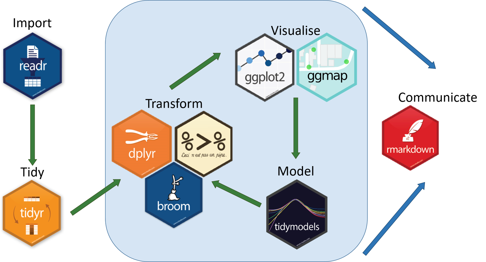
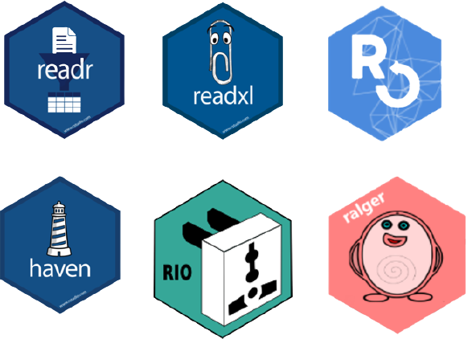

---
output:
  xaringan::moon_reader:
    yolo: false
    lib_dir: libs
    css: xaringan-themer.css
    seal: false
    nature:
      #autoplay: 30000
      #countdown: 60000
      highlightStyle: github
      highlightLines: true
      highlightSpans: true
      countIncrementalSlides: false
      #ratio: 16:9
      slideNumberFormat: "%current%"
editor_options: 
  chunk_output_type: console
---

```{r setup, include=FALSE}
options(htmltools.dir.version = FALSE)

knitr::opts_chunk$set(echo = TRUE, 
                      tidy = 'styler', 
                      comment = NA,
                      message = FALSE,
                      warning = FALSE)
```


```{r xaringan-themer, include=FALSE, warning=FALSE}
library(xaringanthemer)
style_duo_accent(
  primary_color = "#1381B0",
  secondary_color = "#FF961C",
  inverse_header_color = "#FFFFFF"
)

# Loaded packages

install.load::install_load(c("knitr", "xaringanExtra", "xaringan", "tidyverse", "kableExtra", "countdown", "janitor"))

xaringanExtra::use_xaringan_extra(include = c("tile_view", "editable", "share_again", "broadcast", "animate_css", "panelset", "tachyons", "fit_screen", "clipboard", "search", "scribble", "freezeframe"))


use_webcam(width = 150, height = 150)

use_extra_styles()
```

background-image: url(images/gbg.png), url(images/R_logo.png)
background-position: 0% 100%, 100% 0%
background-size: 40%, 10%

class: title-page, center, middle

## RStudio, R packages, and R project

### A typical data science workflow in R

```{r, echo=FALSE}
use_logo(
  image_url = "images/gbg.png",
  link_url = "https://bit.ly/gbganalyst",
  position = xaringanExtra::css_position(top = "1em", right = "1em"),
  exclude_class = c("title-page", "inverse", "hide_logo")
)
```

---

class: about-me-slide, inverse, middle, center

## About the trainer


### Ezekiel Adebayo Ogundepo

#### Data Scientist, Statistician

.fade[Virus Outbreak Data Network (VODAN Africa & Asia)<br> Nigeria Chapter]

[`r icons::fontawesome("link")` https://bit.ly/gbganalyst](https://bit.ly/gbganalyst)
[`r icons::fontawesome("twitter")` @gbganalyst](https://twitter.com/gbganalyst)
[`r icons::icon_style(icons::fontawesome("github"), scale = 1)` @gbganalyst](https://github.com/gbganalyst)

???

class: about-me-slide, inverse, middle, center

---
class: middle

.w-100.lh-copy[

Goal:

> The goal of this training is to help you learn everything about R packages and how to import any data into R programming.

]

---
class: inverse, middle
name: toc


# Table of content

.w-100.lh-copy[

- [R and RStudio](#beg1)

- [R packages and library](#beg2)

- [RStudio project](#beg3)

- [Reading and writing data in R](#beg4)

]

---

class: middle, center, inverse
name: beg1

# R and RStudio

---
## What is R programming

.w-100.lh-copy[
R is a statistical programming language for data cleaning, analysis, visualization, and modelling.
]

```{r, out.width= "85%", out.height="87%", echo=FALSE}
knitr::include_graphics("images/R.PNG")
```

---

## What about RStudio?

.w-100.lh-copy[
RStudio is an integrated development environment (IDE) for R
programming. R Studio makes programming easier and friendly in R.
]

```{r, out.width= "85%", out.height="90%", echo=FALSE}
knitr::include_graphics("images/R_studio.PNG")
```
---

class: middle, center, inverse
name: beg2

# R packages and library


```{r, echo=FALSE}

```

---

layout: true

## R packages and library

---

.w-100.lh-copy[
A package is a collection of R functions that extends basic R functionality (`base::functions`).
]

--

.w-100.lh-copy[
A package can contain a set of functions relating to a specific topic or tasks.
]

--

.w-100.lh-copy[
For example, data wrangling packages include `tidyr`, `janitor`, etc.
]

--

.w-100.lh-copy[
The location where the packages are stored is called a **library**. If there is a particular package that you need, you can install the package from the Comprehensive R Archive Network (**CRAN**) by using:
]
--

```{r, eval=FALSE}
install.packages("pkg_name")
```
--

For example:

```{r, eval=FALSE}
install.packages("tidyverse")
```
--
.w-100.lh-copy[
Please note that the package name must be put on double quotes (**" "**) or a single quote (**' '**).
]

---

.w-100.lh-copy[
Other packages that are not yet on `CRAN` can also be installed from an external repository such as **GitHub** or **GitLab** by using `devtools` or `remotes` packages.
]

--

For example, package `fakir` is not yet on `CRAN`. 
--
 To install `fakir` from the `GitHub` repository,

--
use

--

```{r, eval=FALSE}
devtools::install_github("ThinkR-open/fakir")
```
--

or

--
```{r, eval=FALSE}
remotes::install_github("ThinkR-open/fakir")
```

--

.w-100.lh-copy[
You can also use `devtools` or `remotes` to install development version of a package. 
]

--

```{r, eval=FALSE}
remotes::install_github("datalorax/equatiomatic")
```

---
layout: false

## Import or load a package

.w-100.lh-copy[
Before you can use any installed package, you will need to import or load them by using the command:
]

--

```{r, eval=FALSE}
library(pkg_name)
```
--

.w-100.lh-copy[
which makes that package functions available for you in the R session or environment.
]

--

For example:

--

```{r, eval=FALSE}
library(tidyverse)

library(janitor)

library(ralger)
```

---
background-image: url(images/package.png)
background-size: contain
background-position: 60% 60%

### Think of R package as this:

.w-100.lh-copy[
You only need to install a package once, but you need to reload it every time you start a new session.
]
---
class: middle 

## R Library

.w-100.lh-copy[
Library is a directory where the packages are stored. You can have multiple libraries on your hard disk.
]

--

To see which libraries are available (which paths are searched for packages), use:

--

```{r}
.libPaths()
```
---
class: middle

## Remove installed packages

Remove installed packages/bundles and updates index information as
necessary.

```{r, eval=FALSE}
remove.packages("pkg_name")
```
---

## Use a function from an external package without loading it	


.w-100.lh-copy[
There are two ways to make use of a function in a package. You can
load the package with `library(pkg_name)` and then use any of its `functions`. For example:


```{r, eval=FALSE}
library(install.load)

install_load(c("tidyverse", "janitor", "ralger"))
```

]

--

.w-100.lh-copy[
Or you can use the `::` operator to attach a function to a library i.e. `mypackage::myfunction()`. For example:


```{r, eval=FALSE}
install.load::install_load(c("tidyverse", "janitor", "ralger"))
```

]

--

.w-100.lh-copy[
It is often common to see people using `mypackage::myfunction()` so that the reader of a script can know which function belongs to a particular package.
]

---
class: middle

### Example 1

```{r, eval=FALSE}
library(janitor)

first_5_iris <- head(iris, 5)

clean_names(first_5_iris)
```

```{r, echo=FALSE}
iris %>% head(5) %>% clean_names() %>% kable()
```

---
class: middle

### Example 2

```{r, eval=FALSE}
first_5_iris <- head(iris, 5)

janitor::clean_names(first_5_iris)
```

```{r, echo=FALSE}
iris %>% head(5) %>% clean_names() %>% kable()
```

---

class: middle, center, inverse
name: beg3

# RStudio project

---
layout: true

## Where Does Your Analysis Live?

---

.w-100.lh-copy[
The working directory is where R looks for files that you ask it to load, and where it will put any files that you ask it to save.
]
--

RStudio shows your current working directory at the top of the console:

```{r, echo=FALSE}
include_graphics("images/console.png")
```
--

<br>

and you can also print this out by using:

--

```{r}
getwd()
```
---
class: middle

.w-100.lh-copy[
If you have specific directory that you want to use as your working
directory, in `R` you can do that with the command `setwd()` e.g.
`setwd("/path/to/my/data_analysis")`
]
--

.w-100.lh-copy[
or by using the keyboard shortcut  `Ctrl+Shift+H` and choose that
specific directory (Folder).
]

---
layout: false

## Paths and Directories

- .w-100.lh-copy[**Absolute paths**: This looks different in every computer. In Windows they start with a drive letter (e.g., `C:`). In my R working directory I
have `C:/Users/OGUNDEPO EZEKIEL .A/Desktop/R-training-modules/R-packages-R-project/data/covid19.csv` as absolute path.
]
--

.w-100.lh-copy[
You should never use *absolute paths* in your scripts, because they hinder
sharing and no one else will have exactly the same directory configuration as
you.
]

--

- .w-100.lh-copy[**Relative paths**: With the help of function `here::here()` or `R project`
we can have a relative path like `data/covid19.csv` that
allows for file sharing and collaboration.
]

---

## RStudio Projects
.w-100.lh-copy[
For a typical data science workflow, you should use Rstudio project.
R experts keep all the files associated with a project together—like data
folder, R scripts folder, analytical results folder, figures folder. This is such
a wise and common practice.
]

--

```{r, echo=FALSE}
include_graphics("images/rproj.png")
```

---

## Creating a new R project

Click `File → New Project`, then choose Existing Directory:

```{r, echo=FALSE}
include_graphics("images/step1.PNG")
```

---

Browse for that specific directory (Folder).

--

```{r, echo=FALSE}
include_graphics("images/step2.png")
```

---
class: middle

```{r, echo=FALSE, out.height="100%", out.width="100%"}
include_graphics("images/step3.png")
```

--

Hurray! We are in the `RStudio project`.


---
class: middle

```{r, echo=FALSE}
include_graphics("images/rproj.png")
```
Henceforth, you will click `.Rproj` to open RStudio project.


---

class: middle, center, inverse
name: beg4

# Reading and writing data in R

```{r, echo=FALSE, out.height= "50%", out.width= "60%"}

```
---
layout: true
## Reading and writing data in R

---
.w-100.lh-copy[
Creating a dataframe from scratch is so tedious. In the data science world, data will be available for you on a spreadsheet such as MS-Excel. Our job as a data scientist is to import those datasets into R using any data import packages such as `readr` (.csv), `readxl` (.xlsx), `haven` (.sav, .dta), `rio` (any data file format), or `ralger` (web data).
]

--
.pull-left[

```{r, echo=FALSE, out.height= "100%", out.width= "100%"}
include_graphics("images/import.png")
```
]

--

.pull-right[

.w-100.lh-copy[
Please note that `readr`, `readxl`, and `haven` are part of `tidyverse` set of packages. You can see all the packages in the tidyverse by using:

```{r, eval=FALSE}
tidyverse::tidyverse_packages()
```

]
]
---

- `readr` package:
  - `read_csv()` import a `.csv` file to R 
  
  - `write_csv()` export a dataframe as `.csv` file out of R

--

- `readxl` package:

  - `read_xlsx()` import a `.xlsx` file to R

--

- `writexl` package:
  - `write_xlsx()` export a  dataframe as`.xlsx` file out of R 

--

- `haven` package:

  - `read_sav()` import a `.sav` file to R

  - `write_sav()` export a dataframe as `.sav` file out of R 
  
  - `read_dta()` import a `.dta` file to R

  - `write_dta()` export a dataframe as `.dta` file out of R  
  
---

- `rio` package
  
  - `import()` import any file format to R
  
  - `export()` export a dataframe as any file format out of R
  
For more information on `rio` package, please visit this [resource](https://www.rdocumentation.org/packages/rio/versions/0.5.26).

--

### RStudio Project

.w-100.lh-copy[
To import and export data in R, we will make use of the `RStudio project`, to automatically set up the working directory, and utilize the relative path for the data file path.
]

---
layout: false

### Lab session

```{r, echo=FALSE}
include_graphics("images/lab.png")
```
---
layout: false
class: middle

## Summary

.w-100.lh-copy[
Data science workflow can be done in Rstudio project. This enables you to organize your files i.e. keep data files, the script, save the outputs and by using only relative path.
]
--

.w-100.lh-copy[
Everything you need is in one place, and cleanly separated from all other projects you are working on.
]

--

.w-100.lh-copy[
You can comfortably install any R packages be it on the `CRAN` or `GitHub` and load them to the R environment.
]

--

.w-100.lh-copy[
Now, you can import any file format to R and also export it out.
]


---
class: center, middle, inverse

# The end

--

**Thank you**
